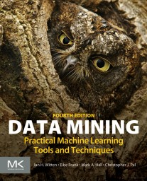

# My personal notes on PARF, Weka, Machine Learning, and the like

* **PARF** - Parallel random forest (RF) algorithm, MPI-enabled, implemented in Fortran, CLI. By Goran Topić and Tomislav Šmuc, from Ruđer Bošković Institute, Croatia
* **Weka** - Machine learning tools and algorithms, including RF, implemented in Java, GUI. By Ian H. Witten, Eibe Frank, Mark A. Hall, Christopher J. Pal, from University of Waikato, New Zealand, and Université de Montréal, Canada

## Directories

PARF

* [parf2008](parf2008/) and [parf2016](parf2016/) - contains the [source code forked from google code](https://code.google.com/archive/p/parf/source/default/source)
* [sources](sources) - contains untouched downloads from google and www.irb.hr
* [docs](docs/) - contains documentation, sourced from source code and elsewhere, converted from google wiki into github-flavored markup using pandoc, and also with some additional notes

Weka

* [datasets](https://waikato.github.io/weka-wiki/datasets/) - some datasets from Weka

## Files

* [parf.ipynb](parf.ipynb) - compiling using Intel Fortran 2021.2
* [parf-sd.ipynb](parf-sd.ipynb) - compiling on SDumont supercomputer
* [usage.ipynb](usage.ipynb) - usage based on [Usage.md](docs/Usage.md)
* [rfintro.ipynb](rfintro.ipynb) - Notebook based on *An Introduction To Building a Classification Model Using Random Forests In Python* from Sahiba Chopra, 2019
* [rfiris.ipynb](rfiris.ipynb) - Notebook based on *Understanding Random Forests Classifiers in Python* by Avinash Navlani, 2018
* [rfasteroid01.ipynb](rfasteroid01.ipynb) - Notebook based on *NASA: Asteroid Classification. Classifying whether an asteroid is hazardous or not* by Shubhankar Rawat, 2019
* [ippsklearn.ipynb](ippsklearn.ipynb) - Notebook based on *Parallel machine learning with scikit-learn* from UL HPC Platform of the University of Luxembourg by the UL HPC Team

## PARF links

* https://www.irb.hr/eng/Scientific-Support-Centres/Centre-for-Informatics-and-Computing/Projects2/IT-projects/PARF
* http://veppar.irb.hr/index.php?option=com_content&task=view&id=16
* https://translate.google.com/translate?sl=auto&tl=en&u=http://www.parf.irb.hr/
* https://code.google.com/archive/p/parf/
* https://link.springer.com/article/10.1186/1471-2156-12-63 - *S. Cabras et al. A strategy analysis for genetic association studies with known inbreeding*. Uses PARF with OpenMPI libraries
* https://epub.ub.uni-muenchen.de/13766/1/TR.pdf - *Overview of Random Forest Methodology and Practical Guidance with Emphasis on Computational Biology and Bioinformatics*. Mention PARF
* https://www.researchgate.net/publication/24214253 - *Capturing the Spectrum of Interaction Effects in Genetic Association Studies by Simulated Evaporative Cooling Network Analysis*. Uses a parallel PARF
* https://www.stat.berkeley.edu/~breiman/RandomForests/cc_home.htm

## Weka links

* Home: https://www.cs.waikato.ac.nz/ml/weka/
* Wiki: https://waikato.github.io/weka-wiki/
* Sourceforge: https://sourceforge.net/projects/weka/
* Documentation: https://sourceforge.net/projects/weka/files/documentation/
* Video Channel: [Data Mining with Weka](https://www.youtube.com/channel/UCXYXSGq6Oz21b43hpW2DCvw)
* Report: [Garcia, JRM. Data Mining To Identify Groups Of Weather Stations Using Historical Precipitation Data.](http://mtc-m16d.sid.inpe.br/col/sid.inpe.br/mtc-m19/2010/12.03.13.37/doc/publicacao.pdf)

### Book

* Errata, Appendix, Slides, Review, additional information: https://www.cs.waikato.ac.nz/ml/weka/book.html

# References

* [Random Forest in Python](https://towardsdatascience.com/random-forest-in-python-24d0893d51c0)
* [Hyperparameter Tuning the Random Forest in Python](https://towardsdatascience.com/hyperparameter-tuning-the-random-forest-in-python-using-scikit-learn-28d2aa77dd74)
* [An Implementation and Explanation of the Random Forest in Python](https://towardsdatascience.com/an-implementation-and-explanation-of-the-random-forest-in-python-77bf308a9b76)
* [Random forest - Wikipedia](https://en.wikipedia.org/wiki/Random_forest)
* [Random Forest Simple Explanation](https://williamkoehrsen.medium.com/random-forest-simple-explanation-377895a60d2d)
* [Understanding Random Forests Classifiers in Python](https://www.datacamp.com/community/tutorials/random-forests-classifier-python)
* [Parallel classification and feature selection in microarray data using SPRINT](https://www.ncbi.nlm.nih.gov/pmc/articles/PMC4038771/)
* [Random Forests of Very Fast Decision Trees on GPU for Mining Evolving Big Data Streams](https://hgpu.org/?p=12445)
* [Reimplementation of the Random Forest Algorithm](https://www.researchgate.net/publication/256089569_Reimplementation_of_the_Random_Forest_Algorithm)
* [CHASM (Cancer-specific High-throughput Annotation of Somatic Mutations)](http://wiki.chasmsoftware.org/index.php/CHASM_DL#PARF_Source_Code)
* [CHASM: Computational Prediction of Driver Missense Mutations](https://cancerres.aacrjournals.org/content/canres/69/16/6660.full.pdf)
* [Optimized implementations of the Random Forest algorithm](https://stats.stackexchange.com/questions/10001/optimized-implementations-of-the-random-forest-algorithm)
* [Capturing the Spectrum of Interaction Effects in Genetic Association Studies by Simulated Evaporative Cooling Network Analysis](https://www.academia.edu/530028/Capturing_the_spectrum_of_interaction_effects_in_genetic_association_studies_by_simulated_evaporative_cooling_network_analysis)
* [Translating criteria of international forest definitions into remote sensing image analysis](https://www.sciencedirect.com/science/article/abs/pii/S0034425714001345)
