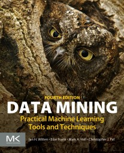

# Weka

Some files in this repo were created and edited using [Weka](https://www.cs.waikato.ac.nz/ml/weka/), which are machine learning tools and algorithms, including RF, implemented in Java . By Ian H. Witten, Eibe Frank, Mark A. Hall, Christopher J. Pal, University of Waikato, New Zealand, and Université de Montréal, Canada. Some links of interest with related materials:

* Home: https://www.cs.waikato.ac.nz/ml/weka/
* Wiki: https://waikato.github.io/weka-wiki/
* Datasets: https://waikato.github.io/weka-wiki/datasets/
* Sourceforge: https://sourceforge.net/projects/weka/
* Documentation: https://sourceforge.net/projects/weka/files/documentation/
* Data Mining with Weka (2017): https://www.youtube.com/channel/UCXYXSGq6Oz21b43hpW2DCvw
* Garcia, JRM (2010). Data Mining To Identify Groups Of Weather Stations Using Historical Precipitation Data: http://mtc-m16d.sid.inpe.br/col/sid.inpe.br/mtc-m19/2010/12.03.13.37/doc/publicacao.pdf

## Book

  
Google Books info: https://www.google.com.br/books/edition/Data_Mining/1SylCgAAQBAJ  
Errata, Appendix, Slides, Review, additional information: https://www.cs.waikato.ac.nz/ml/weka/book.html

 Last edited: 2023-06-27 11:12:06
